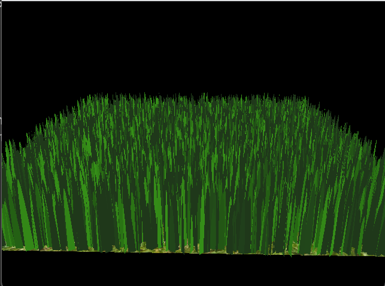

Vulkan Grass Rendering
==================================

* Ruben Young
* Tested on: Windows 11, AMD Ryzen 7 7800X3D, RTX 4080 SUPER (Compute Capability 8.9)

**University of Pennsylvania, CIS 565: GPU Programming and Architecture, Project 5**

### Description

This is a Vulkan-based implementation of [Responsive Real-Time Grass Rendering for General 3D Scenes
](https://www.cg.tuwien.ac.at/research/publications/2017/JAHRMANN-2017-RRTG/JAHRMANN-2017-RRTG-draft.pdf) from Jahrmann and Wimmer.

Each grass blade corresponds to three control points, and a tesselation shader is used to generate the corresponding bezier curve as geometry, which is then shaded.

|  | 
|:--:| 
| Jahrmann et al. |

A simple physical simulation is also applied using a compute shader where each grass blade's control points are repositioned according to physical forces like wind, gravity, and hooke's law.

|  | 
|:--:| 
| Jahrmann et al. |

### Progression

|  | 
|:--:| 
| Basic setup with 1024 blades and minimal tesselation |

|  | 
|:--:| 
| More blades and basic lambertian shading |

|  | 
|:--:| 
| Adding physical simulation |

|  | 
|:--:| 
| Complete result including culling optimizations |

## Performance and Optimization

Additionally to the basic method, several performance optimizations are used to cull unnecessary grass blades with minimal contribution:

- Orientation-Based: Blades oriented orthogonal to the camera's view vector are discarded
- Frustum-Based: Blades outside the view frustum are discarded
- Distance-Based: Blades far away from the camera with minimal contribution are discarded

### Average Frame Time (ms) by Culling Method
| Blade Count | None | Orientation | Frustum | Distance | All  |
|-----------------|------|--------------|----------|-----------|------|
| 2^14            | 0.38 | 0.36         | 0.34     | 0.25      | 0.23 |
| 2^16            | 1.59 | 1.44         | 1.38     | 1.08      | 0.82 |
| 2^18            | 5.85 | 5.52         | 5.20     | 4.01      | 3.20 |
| 2^20            | 22.4 | 21.0         | 20.3     | 15.2      | 12.12 |

As can be seen from the results, all optimizations generate an improvement at this amount of grass blades with Distance-based clearly being the most impactful. However, since distance based culling directly removes grass blades that would otherwise be visible, it also has a high impact on the fidelity of the scene. 